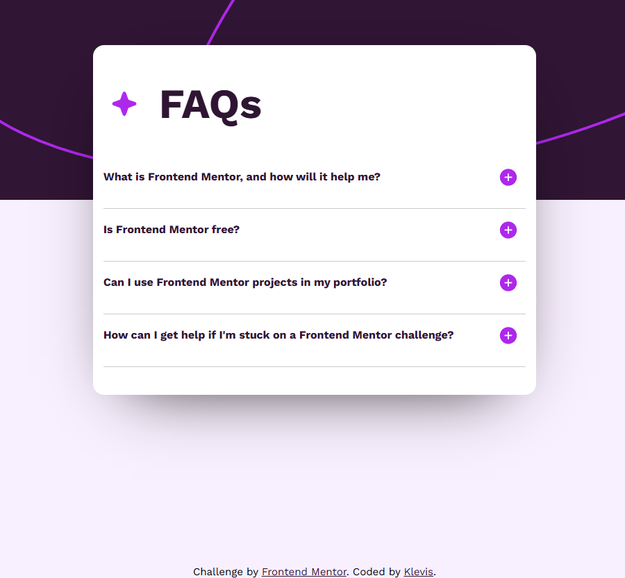
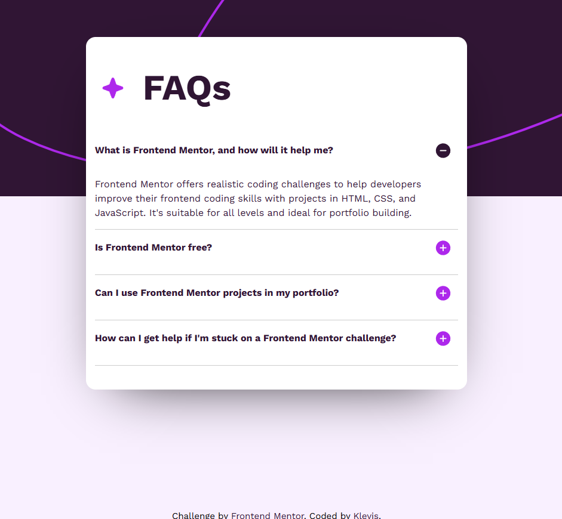

❓ FAQ Accordion Component

A responsive FAQ Accordion Component built as part of a Frontend Mentor challenge.
The project focuses on creating an interactive UI where users can toggle questions to reveal answers.

🚀 Features

- Expand/collapse FAQ items
- Interactive accordion behavior
- Only one section open at a time (optional logic)
- Hover and active states
- Responsive layout (mobile → desktop)
- Clean modern UI design

| Technology             | Purpose                 |
| ---------------------- | ----------------------- |
| **HTML5**              | Semantic page structure |
| **CSS3**               | Styling and layout      |
| **JavaScript**         | Accordion functionality |
| **Flexbox / CSS Grid** | Layout alignment        |
| **GitHub Pages**       | Deployment              |

📸 Previews

Base

Open Accordion

